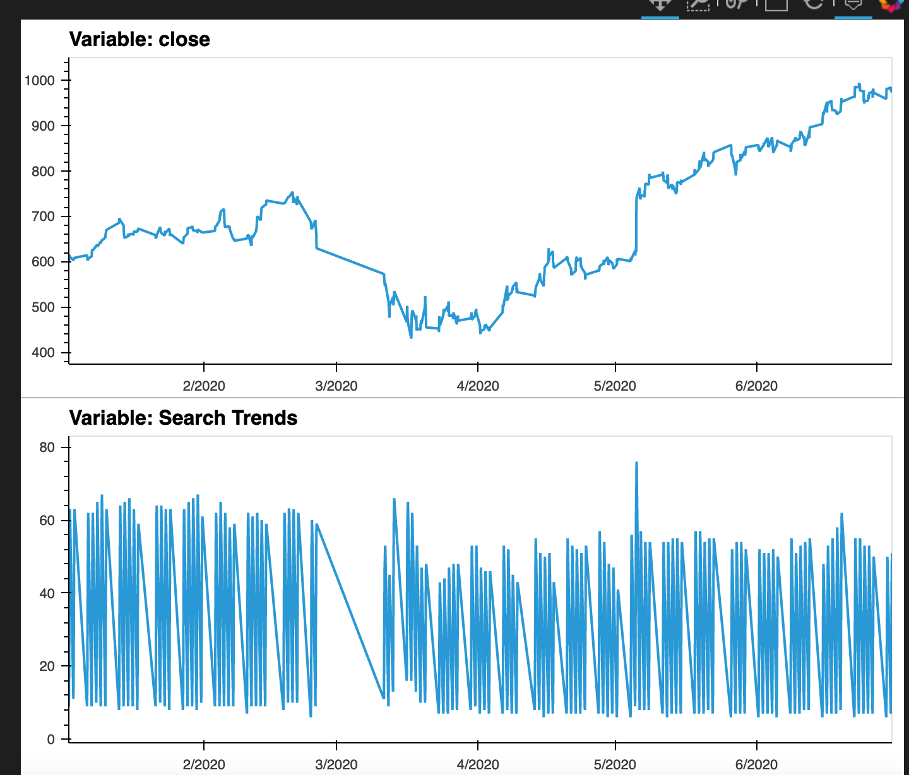
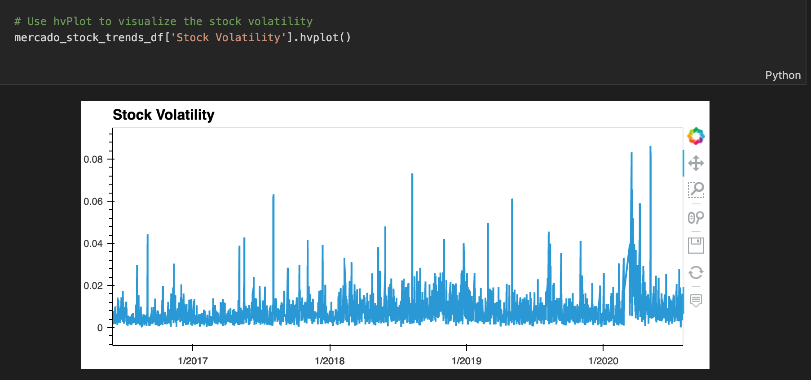
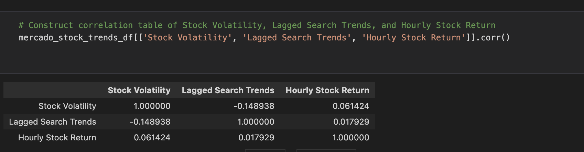
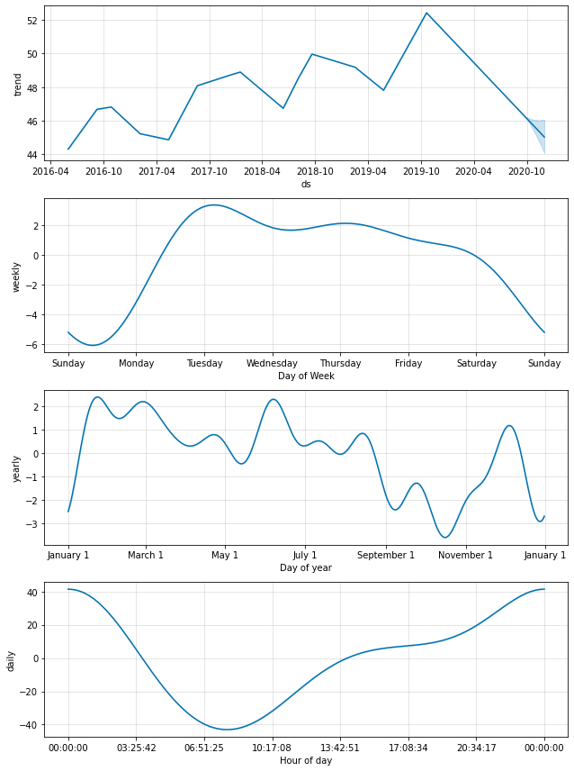

# Predicting with Facebook Prophet Challenge 6 Submission
This challenge analyzes the Mercado Libre's user data to predict search traffic using Facebook's prediction model, Prophet (formally FBprophet).
--

## Technologies

This challenge uses the Prophet, formerly FBprophet, to predict Mercado Libre's search trends into the future.

--

## Installation Guide

The Prophet library must be installed and imported to generate and run the prediction model.

--

## Usage

Search trend and stock price behavior during 2020 is examined. Stock volatility is then visualized. Then a correlation table of stock volatility, hourly stock return, and lagged search trends is generated. Lastly, the user generates a time series model that analyzes and forecasts patterns in the hourly search data. Below are screenshots of these activities:

--

## Contributors
Angela Richter is the sole contributor to all files in this repository.

--

## Licenses

This program and related items in this repository is intended for learning purposes only.